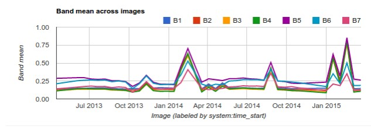
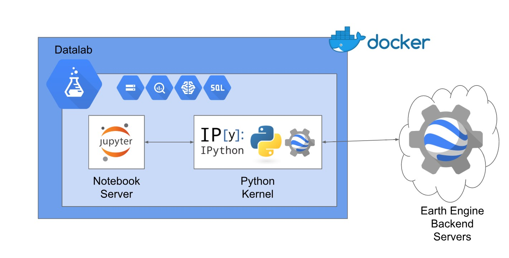

# NMforestwatch
echo "# NMforestwatch" >> README.md

# Welcome to the NMforestwatch development portal!

The purpose of this README file is to describe the workflows and tools in place to make the NMforestwatch portal a reality.  The NMforestwatch portal has the following workflow and technologies in place:

# Javascript//Python interaction with Google Earth Engine API
>Google Earth Engine makes use of Javascript as well as Python for users to interact with the GEE API.  While this repository has javascript code in place for the workflow, the end goal is using the Python API to increase flexibility of use with the GEE API to automate tasks. The two approaches are similar, but the Python based workflow has critical differences to help automation of all tasks.  A GeoServer is made use of in the Javascript solution, while the Python based API interaction relies more heavily on cloud services.

# Javascript API workflow for Google Earth Engine 
* Data Ingest Via Google Earth Engine (GEE)//Landsat 8 TOA Tier 1 Import to Google Earth Engine 
  * This step is accomplished through importing the imagery from Google Earth engine servers.  Google has a robust catalogue of image collections to choose from, including Landsat (1,2,3,4,5,6,7,8), MODIS, Sentinel (1,2,3), as well as many products derived from these image collections.
* Image Collections for New Mexico AOI defined 
  * This is accomplished through the ee.ImageCollection() .filter); function in the Google Earth Engine API.  One of ee.Image() functions is to define polygons and take only imagery intersecting defined polygons.  
* Date range of image collections (3 month interval)
  * Also handled by the ee.ImageCollection() function, selecting date ranges for Imagery available in the GEE catalogue.
* Creating a quality mosaic and eliminating as many discontinuities in the selected image collection as possible.
  * This is accomplished with the qualityMosaic() function.  qualityMosaic() can make the disparate spectral values caused by image collection time differences (time between satellite passes) in vegetation more congruent by attempting to set pixel values from the same stage of growth of the vegetation being imaged. 
* Cloud Masking performed over AOI
  * Cloud masking is accomplished by using the Median.Reduce() function, which can pull cloud free data from the selected image collections over the defined date range.  The potential problem with this method can be found with short date ranges.  The shorter the date range, the less opportunity for cloud free imagery exists.  Another method for cloud free mosaics is using the ee.Algorithms.Landsat.simpleCloudScore() function.  Here, a score is assigned to pixels between 1 and 100, with the higher the number representing a cloudier pixel.  The user can define a preferable score for the pixels over a image collection. Then the scored.select(['cloud']).lte(%%) can be used to mask the clouds in the images.  
* NDVI band calculated and added to image 
  * Here, the %%.map() function is used to apply the NDVI band to the entire image collection.  While an NDVI calculation is trivial with the available tools for manipulating bands (example: var nir = image.select('B5'); var red = image.select('B4'); var ndvi = nir.subtract(red).divide(nir.add(red)).rename('NDVI');) an NDVI layer is also provided due to the ubiquitous nature of NDVI usage in remote sensing realms. The pre-computed NDVI can simply be added to the map and analyzed.  
* Feature collections defined/ Hosted as Google Fusion Table
  * Shapefiles can be converted into .KML files and then can be uploaded as tables to Google's Drive service as Fusion Tables.  Since the tables are hosted by Google in the cloud, the tables can then be imported into Earth Engine and can be used for analysis over each feature in the feature collection.  
* Mean NDVI calculated from individual pixels to perform time scale analysis over vector polygons
  * Earth Engine creates a mean from each pixel within a defined range by using the ee.reduce() function.  The larger the area to create mean statistics, the greater the number of pixels to be defined within the reducer.  
* Charts for time series created
  * Google has a a function that can also create charts over a time series for an image collection.  The ui.Chart() function is used for this.  ee.Reduce() and ui.Chart() are often used together due to the need to reduce when an area exceeds 10,000,000 pixels. 
  * 
* Values of charts exported
* Image collection exported as GeoTiff's
  * GEE makes use of three options for exporting data: Exporting to Google Drive, Exporting to a Google Cloud Storage Bucket, and exporting as an asset within a project.  For this project exporting to Google Cloud Storage will provide the most flexibility in terms of workflow outside of the Google Earth Engine umbrella.  

## Once Images are exported, Javascript based Workflow to host site
* Images collected into SpatialLite Database repositories connected to GeoServer
  * SpatiaLite is based on SQLite with additional spatial coherence and provides a lightweight database to store tables and vector shapes.    
* Database imported into GeoServer
  * Geoserver is outfitted with needed libraries to be cognizant of Spatialite Database
* GeoServer Hosts Web Map Service (WMS) for Vector images to be served to web (found @ http://129.24.65.163:8080/geoserver/web)
  * Styling and hosting of vector layers to overlay raster images
* Javascript imports GeoTiff images from Google Storage to HTML webpage
  * Google Cloud storage serves the tiles to base map on web page
* User selects pre-processed datasets to see NDVI time series for specific polygon sets.
  * The hope will be all process intensive tasks are done by the time the user comes to the page.  Many GUI ideas can be explored. Either a draggable pin to each polygon, a table containing values, and of course time series charts for data visualization. 

# Python API workflow for Google Earth Engine
## Docker Implementation
* Creation of a containerized python environment for transportability from host to host and improved collaboration opportunities and outcomes.  
  * One of the challenges with the Python language is that specific environments can produce differing results.  With Docker, one environment can be created and replicated in different computing environments, ensuring that scripts that have dependencies to run have these specific requirements met. Another advantage of a containerized solution is troubleshooting with a community. Google Earth engine provides a standardized python installation that can easily be replicated for community-based problem solving. 
## Python API Workflow 
### Functions remain the same as Javascript unless otherwise noted
* Authenticate to Google Earth Engine
  * A key difference in the Python API is that requests to Earth Engine Servers need to be authenticated with a unique key.  These authentication procedures need to be adhered to for the Earth Engine servers, to respond to requests. Authentication will be done by using Google Service account that is tied to the web application. The service account will make use of a private and public key (Asymmetric Cryptography), so the service account authenticates to the Earth Engine servers so the public can view the web application without a need for a public key.  

* Automation of Data Ingest Via Google Earth Engine (GEE)//Landsat 8 TOA Tier 1 Import to Google Earth Engine

* Image Collection for New Mexico AIO defined
  
* Date Range definition
  
* Cloud Masking over AOI
  
* NDVI band added
  
* Feature Collections Vectors imported from Fusion Tables

* Mean NDVI calculated for Polygons

* Charts of the time series created

* Chart values Exported to google storage

* Images exported to google storage 
  
  Python development environment, image courtesy of https://docs.google.com/presentation/d/1MVVeyCdm-FrMVRPop6wB3iyd85TAlwB-F9ygTQZ8S1w/pub?slide=id.g22e6c65aa1_0_6
## Web Application hosting
* Google Cloud Datalab hosted locally 
  * Google Cloud Datalab provides an open environment to analyze and process data.  It is built on the Jupyter Notebook (IPython) foundation, so there is a large community and knowledgebase to draw from.  Google Cloud Datalab can be used with Google Cloud services but can also be hosted locally.  In this project Datalab will be hosted locally.
* Python Scripts Served via Jupyter notebook
  * Jupyter Notebook hosts live code to the web.  
* Web application lives in the Google Cloud platform's app engine
  * Google app engine used to run 
* Need for local backend greatly reduced  
 

