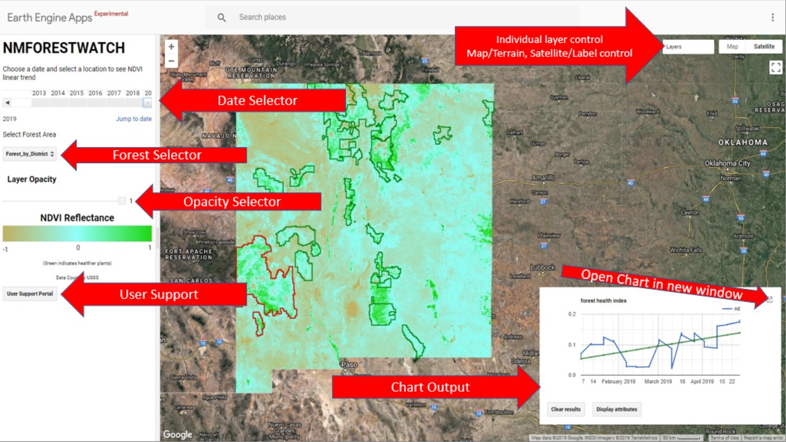
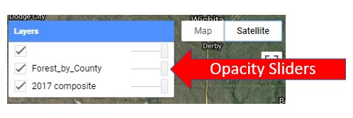
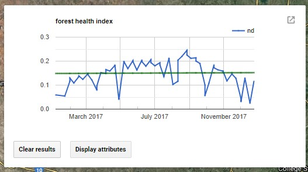

# Welcome to the NMforestwatch User Support!

The purpose of this file is to provide support for end-users of the NMFORESTWATCH portal. If you are looking for more information and background on the project, please view the project development portal: [NMForestWatch Development Portal](https://seanoneill505.github.io/NMforestwatch/DEVELOPMENT.html) 

# How to use NMFOREST WATCH
### User Input Controls
The New Mexico Forest Watch (NMFW) project is designed to give a wide range of end users the capability to perform analysis on integrative forest health in Neww Mexico.  The data is based on the Normalized Difference Vegitation Index (NDVI) taken from Landsat 8 imagery. 

The user is provided three basic functions to analyze National Forests in New Mexico:
* Date Range Selector
  * This allows the end user to select a yearly range from Landsat 8 imagery.  2019 is real-time data and will load slower than cached images. 
* Forest Filter Selector
  * This allows the user to select the forest by district i.e. "Gila National Forest",  by County i.e. "Gila National Forest within Grant County", or Forest by Municipality i.e. Gilan Natioanl Forest within Alamo Cencus Designated Place"
* Click Polygon to analyze NDVI values
  * Once the date range and forest filter are selected, the user can click within a polygon to analyze a linear trend of NDVI values for the selected polygon.  The polygons are additive, so a user can choose Gila national forest in addition to Cibola National Forest and the results will e both polygon values. 
  
 ### Layer Control
It may be helpful to visualize the map to suite your personal preference.  
 * Opacity Slider 
   * Included in the inspector pane is a opcity slider to control all NMFW layers.  This is useful to see the chosen base map in context of the forest health data overlayed.   
 * Layer Control
   * Also provided are controls for individual layers.  Here, the user can change opacity of either the Visualization layer, the Forest layer, or the Selected forest layer.  
* Base Map Control
  * The Base Map controls define the imagery NMFW data is displayed over.  The user can select from a Map view with Terrain option or a satellite view with a labels option. 

### Charting Results
* When a user makes their selection, a chart is produced.  The chart will show the Median value of all 30 meter Pixels within the polygon selection for each month making an annual chart.  A linear trend analysis is also included on the chart to give a user an indication of a declining, constant, or rising NDVI value within the selected area. 

