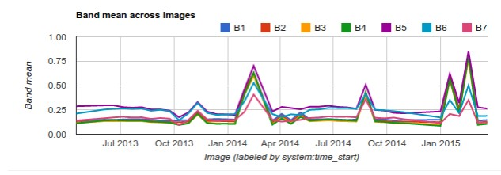

# Welcome to the NMforestwatch User Support!

The purpose of this file is to provide support for end-users of the NMFORESTWATCH portal.  

# How to use NMFOREST WATCH

The New Mexico Forest Watch (NMFW) project is designed to give a wide range of end users the capability to perform analysis on integrative forest health in Neww Mexico.  
The user is provided three basic functions to analyze National Forests in New Mexico:
* Date Range
  * This allows the end user to select a yearly range from Landsat 8 imagery.  2019 is real-time data and will load slower than cached images. 
* Forest filter
  * This allows the user to select the forest by district i.e. "Gila National Forest",  by County i.e. "Gila National Forest within Grant County", or Forest by Municipality i.e. Gilan Natioanl Forest within Alamo Cencus Designated Place"
* Click Polygon to analyze NDVI values
  * Once the date range and forest filter are selected, the user can click within a polygon to analyze a linear trend of NDVI values for the selected polygon.  The polygons are additive, so a user can choose Gila national forest in addition to Cibola National Forest and the results will e both polygon values. 
  

